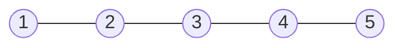
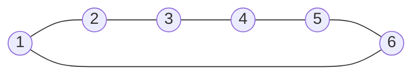
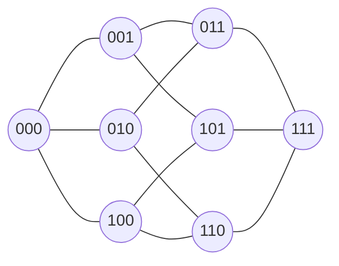
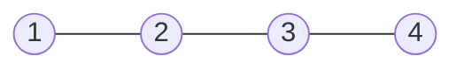
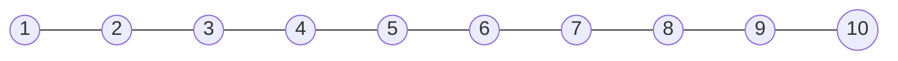
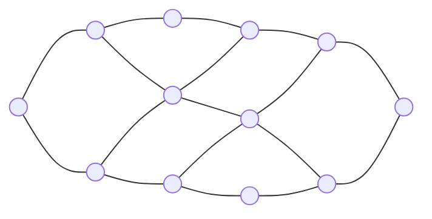
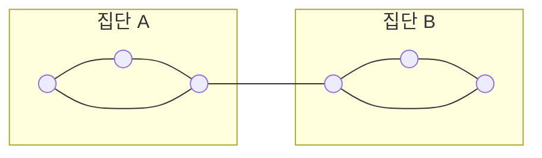

# 1. Introduction

스펙트럴 그래프 이론은 그래프의 연결 구조를 행렬로 표현한 뒤, 그 행렬의 고유값과 고유벡터를 통해 그래프의 성질을 분석하는 분야이다.

그래프 자체는 정점과 변으로 이루어진 조합적 대상이다. 그러나 그래프에 대응하는 인접행렬이나 라플라시안 행렬을 만들면 선형대수학의 도구를 사용할 수 있다.

즉, 스펙트럴 그래프 이론의 기본 흐름은 다음과 같다.

$$\text{그래프의 연결 구조}\longrightarrow\text{행렬}\longrightarrow\text{고유값과 고유벡터}\longrightarrow\text{그래프의 성질}$$

---

## 1.1 Graphs

그래프 $G$는 정점의 집합 $V$와 변의 집합 $E$로 정의한다.

$$G=(V,E)$$

정점은 그래프를 구성하는 대상이며, 변은 두 정점 사이의 연결 관계를 나타낸다.

무방향 그래프에서 변 $(a,b)$는 정점 $a$와 $b$가 서로 연결되어 있다는 뜻이다. 방향이 없으므로 $(a,b)$와 $(b,a)$는 같은 변이다.

$$ (a,b)=(b,a) $$

집합 표기를 사용하면 변을 $\lbrace a,b \rbrace$라고 쓸 수도 있지만, 여기서는 $(a,b)$라는 표기를 사용한다.

이 장에서 다루는 그래프는 별도의 언급이 없는 한 다음 조건을 만족한다고 가정한다.

- 무방향 그래프이다.
- 유한한 개수의 정점을 가진다.
- 자기 자신으로 연결되는 loop가 없다.
- 같은 두 정점 사이에 여러 변이 존재하지 않는다.
- 가중치가 주어지지 않으면 모든 변의 가중치는 $1$이다.

가중 그래프에서는 각 변 $(a,b)$에 양의 가중치 $w_{a,b}$를 부여한다. 가중치는 두 정점 사이의 연결 강도, 거리의 역수, 이동량 등으로 해석할 수 있다.

그래프는 다양한 관계를 표현할 수 있다.

- 사람을 정점으로, 친구 관계를 변으로 표현할 수 있다.
- 컴퓨터나 라우터를 정점으로, 통신 연결을 변으로 표현할 수 있다.
- 전자부품을 정점으로, 전선을 변으로 표현할 수 있다.
- 단백질을 정점으로, 단백질 사이의 상호작용을 변으로 표현할 수 있다.

---

### 1.1.1 Path graph

$n$개의 정점을 가진 경로 그래프 $P_n$은 정점이 일렬로 연결된 그래프이다.

$$V=\lbrace 1,2,\ldots,n \rbrace$$

$$E=\lbrace (i,i+1):1\leq i<n \rbrace$$

예를 들어 $P_5$는 다음과 같다.

---

### 1.1.2 Ring graph

링 그래프 또는 순환 그래프 $R_n$은 경로 그래프에 첫 번째 정점과 마지막 정점을 연결하는 변을 추가한 그래프이다.

$$E=\lbrace (i,i+1):1\leq i<n \rbrace\cup\lbrace (1,n) \rbrace$$

예를 들어 $R_6$은 다음과 같다.

경로 그래프와 달리 시작점과 끝점이 따로 존재하지 않는다.

---

### 1.1.3 Hypercube graph

$d$차원 하이퍼큐브 그래프 $H_d$의 정점은 길이가 $d$인 이진 벡터이다.

$$V=\lbrace 0,1 \rbrace^d$$

두 정점의 좌표가 정확히 하나만 다를 때 두 정점을 변으로 연결한다.

3차원 하이퍼큐브 $H_3$의 정점은 다음 여덟 개이다.

$$000,\ 001,\ 010,\ 011,\ 100,\ 101,\ 110,\ 111$$

각 정점은 자신의 이진 좌표 가운데 하나를 바꾸어 얻어지는 $d$개의 정점과 연결된다. 따라서 $H_d$의 모든 정점의 차수는 $d$이다.

---

## 1.2 Matrices for Graphs

그래프를 분석하기 위해 그래프의 연결 구조를 행렬로 표현한다.

행렬은 단순히 숫자를 배열한 표로만 볼 수 없다. 그래프 이론에서는 행렬을 다음 세 가지 관점으로 해석한다.

1. 그래프의 연결 정보를 저장하는 표
2. 벡터를 다른 벡터로 보내는 선형연산자
3. 벡터를 하나의 실수로 보내는 이차형식

---

## 1.2.1 Matrix as a spreadsheet

그래프 $G=(V,E)$의 인접행렬을 $M$이라고 하자.

행과 열은 각각 그래프의 정점에 대응한다. 인접행렬의 $(a,b)$ 성분은 정점 $a$와 정점 $b$가 연결되어 있는지를 나타낸다.

가중치가 없는 그래프에서는

$$M(a,b)=\begin{cases}1,&(a,b)\in E,\\\\0,&(a,b)\notin E\end{cases}$$

로 정의한다.

가중 그래프에서는

$$M(a,b)=\begin{cases}w_{a,b},&(a,b)\in E,\\\\0,&(a,b)\notin E\end{cases}$$

로 정의한다.

무방향 그래프에서는 $(a,b)$와 $(b,a)$가 같은 변이므로

$$M(a,b)=M(b,a)$$

이다. 따라서 인접행렬은 대칭행렬이다.

$$M=M^T$$

---

### Path graph $P_4$의 인접행렬

다음 경로 그래프를 생각하자.

이 그래프의 인접행렬은

$$M=\begin{pmatrix}0&1&0&0\\\\1&0&1&0\\\\0&1&0&1\\\\0&0&1&0\end{pmatrix}$$

이다.

첫 번째 정점은 두 번째 정점과만 연결되어 있으므로 첫 번째 행은 $(0,1,0,0)$이다.

두 번째 정점은 첫 번째 정점과 세 번째 정점에 연결되어 있으므로 두 번째 행은 $(1,0,1,0)$이다.

행과 열의 번호 자체에는 특별한 의미가 없다. 정점의 이름을 바꾸면 행과 열의 순서가 함께 바뀌지만, 그래프의 연결 구조 자체는 변하지 않는다.

---

## 1.2.2 Matrix as an operator

행렬 $M$은 벡터 $x$를 새로운 벡터 $Mx$로 보내는 선형연산자로 볼 수 있다.

$$x\longmapsto Mx$$

그래프의 정점이 $n$개라면 벡터 $x\in\mathbb R^V$는 각 정점에 실수를 하나씩 배정한다.

$$x(a)=\text{정점 }a\text{에 배정된 값}$$

예를 들어 각 정점에 물질의 양이나 확률을 저장할 수 있다.

인접행렬을 벡터에 곱하면 정점 $a$에서의 출력은 이웃 정점의 값들을 가중합한 값이 된다.

$$(Mx)(a)=\sum_{b:(a,b)\in E}w_{a,b}x(b)$$

즉, 인접행렬은 각 정점에서 이웃들의 정보를 모으는 연산자로 작용한다.

---

### Degree

정점 $a$의 가중 차수 $d(a)$는 정점 $a$에 연결된 변의 가중치 합이다.

$$d(a)=\sum_{b:(a,b)\in E}w_{a,b}$$

가중치가 없는 그래프에서는 단순히 정점 $a$와 연결된 변의 개수이다.

모든 성분이 $1$인 벡터를 $\mathbf 1$이라고 하면 차수 벡터 $d$는

$$d=M\mathbf 1$$

로 구할 수 있다.

실제로

$$(M\mathbf 1)(a)=\sum_{b:(a,b)\in E}w_{a,b}=d(a)$$

이다.

차수행렬 $D$는 각 정점의 차수를 대각성분으로 갖는 대각행렬이다.

$$D(a,a)=d(a)$$

$$D=\operatorname{diag}(d(1),d(2),\ldots,d(n))$$

---

### Walk matrix

그래프 위에서 물질이나 확률이 이웃 정점으로 균등하게 퍼지는 과정을 생각하자.

정점 $a$에 있던 물질은 $d(a)$개의 이웃에게 나누어 전달된다. 이러한 확산을 나타내는 행렬을 walk matrix 또는 diffusion matrix라고 한다.

$$W=MD^{-1}$$

벡터 $p$가 각 정점에 존재하는 물질의 양을 나타낸다면 한 번 이동한 뒤의 분포는

$$p_{\mathrm{new}}=Wp$$

이다.

$D^{-1}$은 먼저 각 정점의 물질을 그 정점의 차수로 나눈다. 그다음 $M$이 그 값을 이웃 정점으로 전달한다.

즉,

$$p\xrightarrow{D^{-1}}\text{각 정점의 값을 차수로 나눔}\xrightarrow{M}\text{이웃으로 전달}$$

이라는 과정이다.

---

### Elementary unit vector

정점 $a$에만 $1$이 있고 나머지 정점에는 모두 $0$이 있는 벡터를 $\delta_a$라고 한다.

$$\delta_a(b)=\begin{cases}1,&a=b,\\\\0,&a\neq b\end{cases}$$

$\delta_a$는 모든 물질이 정점 $a$에만 놓여 있는 상태로 해석할 수 있다.

$D^{-1}\delta_a$는 정점 $a$의 값을 $1/d(a)$로 바꾼다. 이후 $M$을 곱하면 정점 $a$의 각 이웃에 $1/d(a)$씩 전달된다.

$$W\delta_a=MD^{-1}\delta_a$$

따라서 $W$는 그래프 위에서 한 번의 무작위 이동을 수행하는 연산자이다.

---

### Lazy walk matrix

일반적인 random walk는 매 단계마다 반드시 이웃 정점으로 이동한다.

Lazy random walk에서는 확률 $1/2$로 현재 정점에 머물고, 확률 $1/2$로 이웃 정점으로 이동한다.

이에 대응하는 행렬은

$$W_{\mathrm{lazy}}=\frac12I+\frac12W$$

이다.

$Ix=x$이므로 첫 번째 항은 현재 위치에 머무르는 과정을 나타내고, 두 번째 항은 이웃으로 이동하는 과정을 나타낸다.

---

## 1.2.3 Matrix as a quadratic form

행렬 $M$은 벡터 $x$를 하나의 실수 $x^TMx$로 보내는 함수도 정의한다.

$$x\longmapsto x^TMx$$

이와 같은 형태를 이차형식이라고 한다.

그래프에서 가장 자연스러운 이차형식은 라플라시안 행렬로부터 만들어진다.

그래프의 라플라시안 행렬은

$$L=D-M$$

으로 정의한다.

가중 그래프에서는 다음 관계가 성립한다.

$$x^TLx=\sum_{(a,b)\in E}w_{a,b}(x(a)-x(b))^2$$

이 식은 연결된 두 정점 사이에서 $x$의 값이 얼마나 다른지를 측정한다.

- 연결된 정점들의 값이 비슷하면 $(x(a)-x(b))^2$가 작다.
- 연결된 정점들의 값이 크게 다르면 $(x(a)-x(b))^2$가 크다.
- 모든 연결된 정점에서 값이 같으면 전체 합은 $0$이다.

따라서 $x^TLx$는 그래프 위에서 벡터 $x$가 얼마나 부드러운지를 측정한다.

---

### 예시

다음 경로 그래프를 생각하자.

첫 번째 벡터를

$$x=\begin{pmatrix}1\\\\1.1\\\\1.2\\\\1.3\end{pmatrix}$$

라고 하자.

이웃한 정점의 값 차이가 작으므로

$$x^TLx=(1-1.1)^2+(1.1-1.2)^2+(1.2-1.3)^2$$

는 작다.

반면

$$y=\begin{pmatrix}1\\\\-1\\\\1\\\\-1\end{pmatrix}$$

에서는 이웃한 정점의 값이 계속 크게 바뀐다.

$$y^TLy=(1-(-1))^2+((-1)-1)^2+(1-(-1))^2$$

따라서 $y^TLy$는 훨씬 크다.

즉, 라플라시안 이차형식은 그래프 위에서 값이 얼마나 빠르게 진동하는지를 나타낸다.

---

## 1.3 Spectral Theory

스펙트럼 이론은 행렬의 고유값과 고유벡터를 연구한다.

영벡터가 아닌 벡터 $\psi$가

$$M\psi=\mu\psi$$

를 만족하면 $\psi$를 $M$의 고유벡터라고 하고, $\mu$를 그에 대응하는 고유값이라고 한다.

행렬 $M$이 $\psi$에 작용했을 때 방향은 변하지 않고 크기만 $\mu$배 변한다는 뜻이다.

$$\psi\longmapsto M\psi=\mu\psi$$

$\mu$가 고유값이라는 것은

$$(\mu I-M)\psi=0$$

을 만족하는 영벡터가 아닌 $\psi$가 존재한다는 뜻이다.

따라서 $\mu I-M$은 가역행렬이 아니며

$$\det(\mu I-M)=0$$

이 성립한다.

행렬 $M$의 고유값은 특성다항식

$$p(t)=\det(tI-M)$$

의 근이다.

---

## 1.3.1 Spectral theorem

> **정리 1.3.1 — Spectral theorem**
>
> $M$이 $n\times n$ 실수 대칭행렬이면 $M$은 서로 직교하는 $n$개의 단위고유벡터를 가진다.
>
> 즉, 실수 $\mu_1,\ldots,\mu_n$과 정규직교벡터 $v_1,\ldots,v_n$이 존재하여
>
> $$Mv_i=\mu_i v_i$$
>
> 가 성립한다.

고유벡터들이 정규직교하므로

$$v_i^Tv_j=\begin{cases}1,&i=j,\\\\0,&i\neq j\end{cases}$$

이다.

이 고유벡터들은 $\mathbb R^n$의 정규직교기저를 이룬다. 따라서 임의의 벡터 $x\in\mathbb R^n$은

$$x=\sum_{i=1}^nc_iv_i$$

와 같이 고유벡터들의 선형결합으로 나타낼 수 있다.

각 계수는 내적으로 구할 수 있다.

$$c_i=v_i^Tx$$

대칭행렬에서 고유값과 고유벡터가 중요한 이유는 행렬의 모든 작용을 서로 직교하는 고유방향별 작용으로 분해할 수 있기 때문이다.

$$M=\sum_{i=1}^n\mu_iv_iv_i^T$$

이 식을 스펙트럼 분해라고 한다.

---

### 고유벡터는 유일하지 않다

$v$가 고유값 $\mu$에 대응하는 고유벡터이면 $-v$도 같은 고유값에 대응하는 고유벡터이다.

$$Mv=\mu v$$

이면

$$M(-v)=-Mv=-\mu v=\mu(-v)$$

이다.

따라서 고유벡터의 부호는 유일하게 정해지지 않는다.

하나의 고유값이 반복되면 고유벡터는 더욱 유일하지 않다. 예를 들어

$$Mv_1=\mu v_1,\qquad Mv_2=\mu v_2$$

이면

$$M(v_1+v_2)=\mu(v_1+v_2)$$

이므로 $v_1+v_2$도 같은 고유값에 대응하는 고유벡터이다.

---

## 1.3.2 Positive definite and positive semidefinite matrices

실수 대칭행렬 $M$의 모든 고유값이 양수이면 $M$을 양의 정부호행렬이라고 한다.

$$M\succ0$$

실수 대칭행렬 $M$의 모든 고유값이 음이 아니면 $M$을 양의 준정부호행렬이라고 한다.

$$M\succeq0$$

라플라시안 행렬은 항상 양의 준정부호행렬이다.

> **명제 1.3.2 — 라플라시안 행렬의 양의 준정부호성**
>
> 양의 가중치를 가진 그래프의 라플라시안 행렬 $L$은 양의 준정부호행렬이다.
>
> **증명**
>
> 라플라시안의 고유값 $\lambda$와 그에 대응하는 단위고유벡터 $v$를 생각하자.
>
> $$Lv=\lambda v$$
>
> 양변에 왼쪽에서 $v^T$를 곱하면
>
> $$v^TLv=v^T(\lambda v)=\lambda v^Tv=\lambda$$
>
> 이다.
>
> 한편 라플라시안 이차형식에 의해
>
> $$v^TLv=\sum_{(a,b)\in E}w_{a,b}(v(a)-v(b))^2\geq0$$
>
> 이다.
>
> 따라서
>
> $$\lambda\geq0$$
>
> 이므로 라플라시안의 모든 고유값은 음이 아니다.

라플라시안의 고유값은 작은 순서대로 배열한다.

$$0=\lambda_1\leq\lambda_2\leq\cdots\leq\lambda_n$$

$\lambda_1=0$에 대응하는 고유벡터는 상수벡터이다.

$$\mathbf 1=\begin{pmatrix}1\\\\1\\\\\vdots\\\\1\end{pmatrix}$$

실제로 모든 정점에서 값이 같으면 모든 변에 대해 값의 차이가 $0$이므로

$$L\mathbf 1=0$$

이다.

---

## 1.4 Path graph의 고유벡터

경로 그래프 $P_n$의 라플라시안 고유벡터는 그래프 위에서 서로 다른 진동 형태를 나타낸다.

다음은 $P_{10}$이다.

라플라시안의 첫 번째 고유벡터 $v_1$은 모든 좌표가 같은 상수벡터이다.

$$v_1=\frac1{\sqrt{n}}\mathbf 1$$

이 벡터에서는 모든 이웃 정점의 값이 같으므로 진동이 없다.

두 번째 고유벡터 $v_2$는 경로를 따라 천천히 값이 변한다. 값이 한쪽 끝에서 다른 쪽 끝으로 부드럽게 증가하거나 감소한다.

세 번째와 네 번째 고유벡터로 갈수록 경로 위에서 값이 더 자주 위아래로 바뀐다.

가장 큰 고유값 $\lambda_n$에 대응하는 고유벡터는 대체로 이웃 정점마다 부호가 번갈아 나타난다.

$$+,-,+,-,+,-,\ldots$$

따라서 작은 고유값에 대응하는 고유벡터를 low-frequency eigenvector라고 하고, 큰 고유값에 대응하는 고유벡터를 high-frequency eigenvector라고 한다.

라플라시안 이차형식

$$v^TLv=\sum_{(a,b)\in E}(v(a)-v(b))^2$$

을 보면 그 이유를 알 수 있다.

- 값이 천천히 변하면 이웃 사이의 차이가 작으므로 고유값이 작다.
- 값이 빠르게 진동하면 이웃 사이의 차이가 크므로 고유값이 크다.

---

## 1.5 Spectral graph drawing

라플라시안의 고유벡터를 이용하면 각 정점의 좌표를 만들 수 있다.

정점 $a$의 가로 좌표를 두 번째 고유벡터의 성분 $v_2(a)$로 정하고, 세로 좌표를 세 번째 고유벡터의 성분 $v_3(a)$로 정한다.

$$a\longmapsto\bigl(v_2(a),v_3(a)\bigr)$$

이렇게 각 정점을 배치한 뒤 원래 그래프의 변을 연결하면 그래프의 구조를 반영하는 그림을 얻을 수 있다.

예를 들어 $3\times4$ 격자 그래프는 다음과 같다.

격자 그래프의 $v_2$와 $v_3$는 각각 그래프의 가로 방향과 세로 방향의 좌표처럼 작용한다.

그래프의 원래 위치 정보를 모르는 경우에도 라플라시안 고유벡터만으로 그래프의 자연스러운 배치를 복원할 수 있다.

---

## 1.5.1 고유벡터 좌표의 의미

벡터 $v\in\mathbb R^V$의 성분 $v(a)$는 정점 $a$에 배정된 하나의 실수이다.

따라서 하나의 고유벡터는 모든 정점에 하나의 좌표를 배정한다.

$$v=\begin{pmatrix}v(1)\\\\v(2)\\\\\vdots\\\\v(n)\end{pmatrix}$$

두 개의 고유벡터 $v_2,v_3$를 사용하면 각 정점에 두 개의 좌표를 배정할 수 있다.

$$a\longmapsto\bigl(v_2(a),v_3(a)\bigr)$$

세 개의 고유벡터를 사용하면 각 정점을 3차원에 배치할 수 있다.

$$a\longmapsto\bigl(v_2(a),v_3(a),v_4(a)\bigr)$$

즉, 고유벡터 하나는 그래프의 모든 정점에 하나의 좌표축을 제공한다.

---

## 1.5.2 Graph isomorphism

그래프의 정점 이름을 바꾸어도 그래프의 연결 구조는 변하지 않는다.

정점의 순서를 바꾸는 순열행렬을 $\Pi$라고 하자. 라플라시안 행렬 $L$에서 정점의 순서를 바꾸면 새로운 라플라시안 행렬은

$$L'=\Pi L\Pi^T$$

가 된다.

> **명제 1.5.1 — 정점 순열에 대한 고유값의 불변성**
>
> $Lv=\lambda v$이면
>
> $$L'(\Pi v)=\lambda(\Pi v)$$
>
> 이다.
>
> **증명**
>
> $L'=\Pi L\Pi^T$와 $\Pi^T\Pi=I$를 사용하면
>
> $$L'(\Pi v)=(\Pi L\Pi^T)(\Pi v)=\Pi L(\Pi^T\Pi)v=\Pi Lv=\Pi(\lambda v)=\lambda(\Pi v)$$
>
> 이다.

따라서 정점의 이름을 바꾸어도 고유값은 변하지 않는다. 고유벡터의 좌표 순서만 정점의 순서에 맞게 바뀐다.

그래서 두 그래프의 고유값 집합이 다르면 두 그래프는 동형이 아니다.

다만 두 그래프의 고유값이 같다고 해서 반드시 동형인 것은 아니다. 서로 다른 그래프가 동일한 고유값을 가질 수도 있다.

$$\text{고유값이 다름}\Longrightarrow\text{동형이 아님}$$

$$\text{고유값이 같음}\centernot\Longrightarrow\text{반드시 동형}$$

---

## 1.5.3 Platonic solids and multiplicity

어떤 그래프는 2차원보다 3차원에 배치하는 것이 더 자연스럽다.

예를 들어 정십이면체의 뼈대를 그래프로 생각하면 두 번째로 작은 라플라시안 고유값이 중복도 $3$을 가진다.

$$\lambda_2=\lambda_3=\lambda_4$$

이 경우 하나의 고유값에 대응하는 고유공간의 차원이 $3$이다.

따라서 이 고유공간에서 서로 직교하는 세 고유벡터를 선택하여

$$a\longmapsto\bigl(v_2(a),v_3(a),v_4(a)\bigr)$$

로 정점을 배치하면 정십이면체의 자연스러운 3차원 구조를 얻을 수 있다.

고유값의 중복도는 그래프가 자연스럽게 표현되는 공간의 차원과 관련될 수 있다.

---

## 1.5.4 Fiedler value

그래프 라플라시안의 두 번째로 작은 고유값 $\lambda_2$를 Fiedler value 또는 algebraic connectivity라고 한다.

$$0=\lambda_1\leq\lambda_2\leq\cdots\leq\lambda_n$$

$\lambda_2$는 그래프의 연결 정도를 나타낸다.

$$\lambda_2>0\Longleftrightarrow G\text{가 연결 그래프이다}$$

그래프가 여러 연결성분으로 나뉘어 있으면 각 연결성분마다 독립적인 상수벡터를 만들 수 있다. 따라서 고유값 $0$의 중복도가 연결성분의 개수만큼 증가한다.

반대로 그래프가 연결되어 있으면

$$x^TLx=\sum_{(a,b)\in E}w_{a,b}(x(a)-x(b))^2=0$$

이 되기 위해 모든 변에서 $x(a)=x(b)$이어야 한다.

연결된 그래프에서는 모든 정점이 경로로 이어져 있으므로 결국 모든 정점에서 값이 같아야 한다. 따라서 연결 그래프에서 고유값 $0$의 고유공간은 상수벡터 방향 하나뿐이다.

$\lambda_2$가 작으면 그래프 안에 약하게 연결된 두 집단이 존재할 가능성이 크다.

각 집단 내부에는 변이 많지만 두 집단 사이에는 변이 하나뿐이다. 이 경우 가운데 변 하나를 제거하면 그래프가 두 부분으로 분리된다.

따라서 이런 그래프는 연결되어 있더라도 연결 강도가 약하며, 일반적으로 $\lambda_2$가 작다.

반대로 $\lambda_2$가 크면 그래프를 적은 수의 변만 제거하여 큰 두 집단으로 나누기 어렵다.

---

## 1.5.5 Bounding eigenvalues

그래프의 구조를 분석할 때 특정 고유값의 정확한 값보다 상한과 하한이 더 중요할 때가 많다.

대표적인 방법은 다음과 같다.

- 적절한 test vector를 Rayleigh quotient에 대입한다.
- 이미 고유값을 알고 있는 단순한 그래프와 비교한다.
- 정점의 차수나 그래프의 부분구조를 이용한다.
- Courant–Fischer 정리를 이용한다.

특히 라플라시안의 두 번째 고유값은 그래프의 연결성과 관련되므로 여러 방법으로 상한과 하한을 구하게 된다.

---

## 1.5.6 Planar graphs

평면 그래프는 변이 서로 교차하지 않도록 평면에 그릴 수 있는 그래프이다.

라플라시안 고유벡터를 이용하면 그래프를 평면에 배치할 수 있다.

또한 그래프의 변을 용수철로 생각하고, 일부 정점의 위치를 고정한 뒤 나머지 정점이 힘의 균형을 이루도록 놓는 방식으로도 그래프를 그릴 수 있다.

이 방법은 그래프의 라플라시안 선형방정식과 연결된다.

---

## 1.5.7 Random walks on graphs

Random walk에서는 현재 정점에서 이웃 정점 가운데 하나를 선택해 이동한다.

그래프 위의 확률분포를 $p_t$라고 하면 한 단계 이후의 분포는

$$p_{t+1}=Wp_t$$

이다.

여러 단계를 이동하면

$$p_t=W^tp_0$$

가 된다.

따라서 random walk의 장기적인 움직임을 이해하려면 행렬 $W$를 반복해서 곱했을 때의 결과를 분석해야 한다.

행렬의 거듭제곱은 고유값과 고유벡터를 이용하면 쉽게 이해할 수 있다.

$$Wv_i=\omega_i v_i\Longrightarrow W^tv_i=\omega_i^tv_i$$

그래서 스펙트럼 이론은 random walk의 수렴속도와 안정분포를 연구하는 핵심 도구이다.

---

## 1.5.8 Expander graphs

Expander graph는 변의 수는 비교적 적지만 매우 강하게 연결된 그래프이다.

보통 정점 수에 비례하는 정도의 변만 가지면서도 $\lambda_2$가 $0$에서 충분히 떨어져 있는 그래프를 의미한다.

$$|E|=O(|V|),\qquad \lambda_2\geq c>0$$

Expander graph에서는 어느 정도 큰 정점 집합을 선택하더라도 그 집합 밖으로 나가는 변이 많이 존재한다.

이러한 성질 때문에 expander graph는 다음 분야에서 사용된다.

- 의사난수 생성
- 오류정정 부호
- 네트워크 설계
- 계산복잡도 이론
- 그래프 근사

---

## 1.5.9 Graph approximation

두 그래프 $G$와 $H$가 얼마나 비슷한지를 라플라시안 이차형식으로 비교할 수 있다.

모든 벡터 $x$에 대해

$$x^TL_Gx\approx x^TL_Hx$$

가 성립하면 두 그래프는 스펙트럼 관점에서 서로 비슷하다고 볼 수 있다.

그래프의 변 일부만 남기면서도 라플라시안 이차형식을 거의 보존하는 과정을 sparsification이라고 한다.

즉, 복잡한 그래프를 더 적은 변을 가진 그래프로 바꾸면서 중요한 스펙트럼 구조는 유지하는 것이다.

---

## 1.5.10 Laplacian linear systems

그래프 라플라시안에 관한 선형방정식

$$Lx=b$$

을 빠르게 푸는 문제는 여러 분야에서 등장한다.

- 전기회로의 전압과 전류 계산
- 네트워크 흐름 문제
- 편미분방정식의 수치해석
- 머신러닝의 분류 문제
- 그래프 기반 최적화

큰 그래프에서는 직접적인 행렬 역계산이 비효율적이므로 반복법과 preconditioning을 사용한다.

그래프를 더 단순한 그래프로 근사하는 이유도 라플라시안 선형방정식을 빠르게 풀기 위해서이다.

---

$$a\longmapsto\bigl(v_2(a),v_3(a)\bigr)$$

결국 스펙트럴 그래프 이론은 그래프의 조합적 구조를 행렬의 고유값과 고유벡터를 통해 이해하는 이론이다.

$$\boxed{\text{그래프}\longrightarrow\text{행렬}\longrightarrow\text{스펙트럼}\longrightarrow\text{그래프의 구조}}$$
